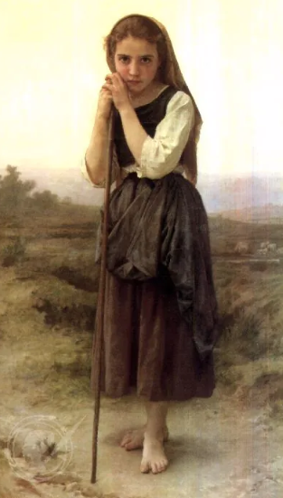

# ShareGPT4V-7B: Adaptation for Cross-Lingual Image Description Generation using LoRA

This repository contains our project focused on adapting the **ShareGPT4V-7B** vision-language model to generate image descriptions in **Lithuanian** when given an image and an English prompt.

## Project Overview

The core idea of this project is to leverage parameter-efficient fine-tuning techniques to enable cross-lingual capabilities in a large vision-language model, specifically for a low-resource language like Lithuanian. The original ShareGPT4V-7B model, while built on a multilingual base (LLaMA), was further fine-tuned predominantly on English data, which suppressed its ability to generate responses in other languages.

Our work aimed to restore this Lithuanian language capability. More specifically, to demonstrate the effectiveness of this approach, we fine-tuned the model to generate rich, stylistically appropriate descriptions of images in Lithuanian when prompted in English. This was achieved through the use of **Low-Rank Adaptation (LoRA)** combined with **4-bit quantization (QLoRA)**, training less than 1% of the model's parameters on a custom dataset of 2,245 Lithuanian image-caption pairs. This approach allows us to utilize the model's existing visual and linguistic understanding while efficiently adapting it to a new task with minimal computational resources.

The training was completed in approximately 3.5 hours on a single Nvidia L4 GPU.

## Example: Model Output Comparison

Below is an example (from Appendix C, Figure 11 of our report) showing the input image and the differing responses from the original ShareGPT4V-7B model versus our LoRA-adapted version when prompted in English to describe the visual features:

 
*Input Image: "A Little Shepherdess" by William-Adolphe Bouguereau*

| User Prompt |
|-|
| Produce a logically connected paragraph of formal analysis that confines its scope to the visual features, excluding all other elements. |

| Original ShareGPT4V-7B Output (English)                                                                                                                                                                                                                                                                                                                                                                                                                                                                                                                                                   | Our LoRA-Adapted Model Output (Lithuanian)                                                                                                                                                                                                                                                                                                                                                                                                                                                                                                                                                                                                                                                                              |
| :----------------------------------------------------------------------------------------------------------------------------------------------------------------------------------------------------------------------------------------------------------------------------------------------------------------------------------------------------------------------------------------------------------------------------------------------------------------------------------------------------------------------------------------------------------------------------------------- | :--------------------------------------------------------------------------------------------------------------------------------------------------------------------------------------------------------------------------------------------------------------------------------------------------------------------------------------------------------------------------------------------------------------------------------------------------------------------------------------------------------------------------------------------------------------------------------------------------------------------------------------------------------------------------------------------------------------------------------- |
| The image portrays a young girl standing in a field, exuding a sense of tranquility and innocence. She is dressed in a simple brown dress, which contrasts with the vibrant colors of the landscape around her. In her hand, she holds a walking stick, suggesting a journey or exploration. Her gaze is directed off to the side, and her expression is one of contemplation, as if lost in thought or observing something in the distance. The background is a picturesque landscape, filled with trees and rolling hills under a clear blue sky, adding to the serene atmosphere of the scene. The painting is executed in an impressionist style, characterized by loose brushstrokes and a focus on the interplay of light and color. The genre of the artwork is landscape, as it depicts a natural scene with the girl as the main subject. The overall composition and elements within the painting evoke a sense of peace and solitude, capturing a moment of quiet reflection in nature. | Ši tapyba vaizduoja jauną mergaitę, kurios žvilgsnis nukreiptas į žiūrovą, sukuriant intymumo ir ryšio jausmą. Mergaitės kūnas pavaizduotas su nepaprastu detalumu, nuo subtilių jos odos nėrinių iki sudėtingų jos plaukų raukšlių. Menininko įgudęs šviesos ir šešėlio valdymas sustiprina figūros trimatiškumą, metant subtilius šešėlius, kurie pabrėžia jos formos ir sukuria gylio jausmą. Mergaitės drabužiai, pavaizduoti turtingais raudonų ir mėlynų atspalviais, suteikia kompozicijai prabangos ir elegancijos. Fone matome švelnių, miglotų kraštovaizdžių, kurie suteikia ramų ir atmosferinį kontekstą. Bendras efektas yra harmonijos ir pusiausvyros jausmas, kur mergaitės figūra yra susiliejusi su jos aplinka, sukuriant vizualiai patrauklų ir emocingą meno kūrinį. |

## Key Outcomes

* The fine-tuned model now reliably generates stylistically rich descriptions in **Lithuanian** for images when prompted in English, as demonstrated in the example above.
* This work demonstrates an efficient method for adapting large multimodal models for cross-lingual tasks, especially for restoring capabilities in low-resource languages without requiring full model retraining or extensive computational resources.
* Our findings suggest LoRA can be a lightweight mechanism to reintroduce or layer functionalities onto specialized models that may have lost general capabilities during intensive fine-tuning.

This repository is a fork of the official [ShareGPT4V repository](https://github.com/ShareGPT4Omni/ShareGPT4V). Our implementation and adaptations for Lithuanian language generation are detailed within.

For a comprehensive understanding of the methodology, data, and more examples, please refer to our full report (`[TODO]`).